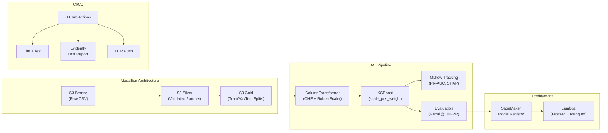
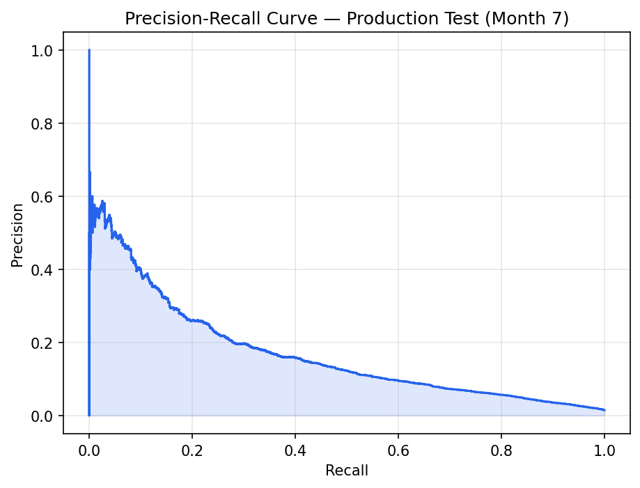
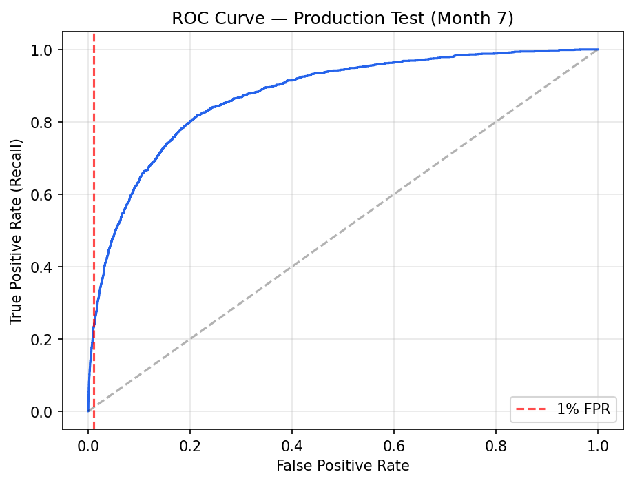
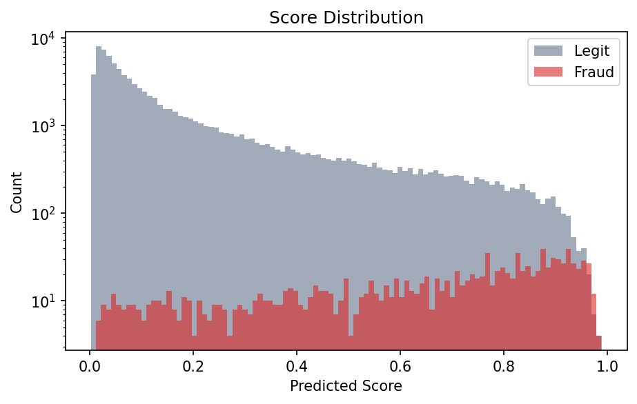
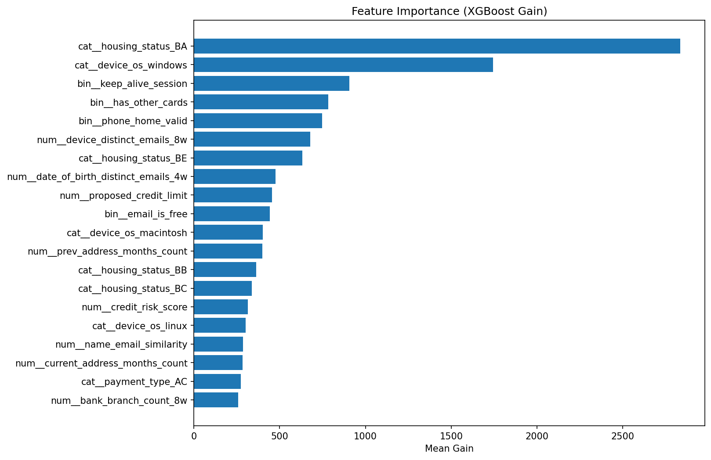

# SafeGuard ML — Fraud Detection Pipeline

Production-grade fraud detection system built on AWS, using the [Bank Account Fraud (BAF) Dataset — Variant II](https://arxiv.org/abs/2211.13358) (NeurIPS 2022). Processes **1M transactions** with a Medallion Architecture on S3, temporal-aware training, fairness-aware preprocessing, and a fully automated CI/CD pipeline.

## Model Results

Trained on months 0-5, validated on month 6, evaluated on **unseen month 7** (production simulation):

| Metric | Validation (Month 6) | Test (Month 7) | Why It Matters |
|--------|---------------------|----------------|----------------|
| **ROC-AUC** | 0.883 | 0.874 | Strong overall discrimination |
| **PR-AUC** | 0.181 | 0.169 | ~17x better than random baseline for 1% prevalence |
| **Recall @ 1% FPR** | 0.234 | 0.226 | Catches 23% of fraud while falsely flagging only 1% of legit |
| **Recall @ 5% FPR** | — | 0.485 | At 5% FPR, catches nearly half of all fraud |
| **Best F1** | 0.247 | 0.241 | Optimal precision-recall balance |
| **Class Ratio** | 96.5:1 | 96.5:1 | Extreme imbalance handled via `scale_pos_weight` |

## Architecture



## Design Decisions

| Decision | Rationale |
|----------|-----------|
| **Polars** over Pandas for loading | Lazy evaluation keeps memory flat for 1M+ rows; 224 MB dataset loads in ~0.5s |
| **Temporal split** (not random) | Random splitting leaks future patterns into training. Month-based split mirrors real deployment where the model never sees tomorrow's data |
| **scale_pos_weight** (96.5:1) | Auto-computed from class ratio. Also implemented **custom focal loss** as alternative — down-weights easy negatives so the model focuses on hard fraud cases |
| **Recall @ 1% FPR** as primary metric | Banking industry standard. A 5% FPR means 1 in 20 legitimate customers gets flagged — unacceptable. At 1% FPR, we catch 24% of fraud |
| **RobustScaler** (not StandardScaler) | Fraud features like `velocity_6h` and `intended_balcon_amount` have extreme outliers. RobustScaler uses median/IQR, making it resistant to these |
| **Fairness "unaware" mode** | Protected attributes (age, income, employment) excluded from model input but preserved in a sidecar DataFrame for post-hoc fairness auditing (per-group TPR, FPR, selection rate) |
| **Great Expectations quality gate** | Catches data corruption before training — validates month sequentiality, null checks on protected attributes, and feature range plausibility |
| **Evidently drift monitoring** | Compares month 7 feature distributions against training months. Detects covariate shift that could silently degrade model performance |

## Project Structure

```
safeguard-ml-fraud-detection-pipeline/
├── .github/workflows/pipeline.yml   # CI/CD: lint, test, drift report, deploy
├── app/
│   └── handler.py                   # FastAPI + Mangum Lambda handler
├── configs/
│   └── fraud_config.yaml            # Features, hyperparameters, thresholds
├── data/
│   └── Variant II.csv               # BAF Variant II dataset (not committed)
├── src/
│   ├── data_engineering.py          # Polars loader, temporal split, Medallion
│   ├── feature_pipeline.py          # ColumnTransformer, fairness preprocessing
│   ├── train.py                     # XGBoost + focal loss + MLflow + SHAP
│   ├── evaluate.py                  # PR curves, Recall@1%FPR, fairness audit
│   ├── data_integrity.py            # Great Expectations quality gate
│   └── monitoring.py                # Evidently drift report (month 7 vs train)
├── terraform/                       # S3, ECR, MLflow, IAM (least-privilege)
├── tests/                           # pytest suite with synthetic fixtures
├── Dockerfile                       # Lambda-compatible container
├── Makefile                         # Automation targets
├── pyproject.toml                   # Dependencies and tooling config
└── requirements.txt                 # Pinned production dependencies
```

## Quick Start

```bash
# 1. Install dependencies
make install

# 2. Place the BAF Variant II dataset at data/Variant II.csv

# 3. Run quality gate
make integrity

# 4. Train model (logs to MLflow)
make train

# 5. Evaluate on month-7 test set
make evaluate

# 6. Generate drift monitoring report
make monitor

# 7. Run tests
make test

# 8. Lint
make lint
```

## Dataset — BAF Variant II

30 features across 1M transactions with ~1% fraud rate.

| Feature Type | Count | Examples | Preprocessing |
|-------------|-------|---------|---------------|
| **Categorical** | 4 | `payment_type`, `housing_status`, `source`, `device_os` | OneHotEncoder (18 encoded) |
| **Numerical** | 17 | `velocity_6h`, `velocity_24h`, `credit_risk_score`, `zip_count_4w` | RobustScaler |
| **Binary** | 6 | `email_is_free`, `phone_home_valid`, `foreign_request` | Passthrough |
| **Protected** | 3 | `customer_age`, `employment_status`, `income` | Excluded from model (fairness) |
| **Total features after encoding** | **41** | | |

### Temporal Split (No Data Leakage)

| Split | Months | Rows | Fraud Rate | Purpose |
|-------|--------|------|-----------|---------|
| Train | 0-5 | 794,990 | 1.03% | Model development |
| Validation | 6 | 108,168 | 1.34% | Early stopping, hyperparameter tuning |
| Test | 7 | 96,842 | 1.47% | Production / unseen evaluation |

## Visual Results

### Precision-Recall Curve (Test Set — Month 7)


### ROC Curve (Test Set — Month 7)


### Score Distribution (Fraud vs Legitimate)


### Feature Importance (XGBoost Gain)


## MLflow Tracked Artifacts

Each training run logs to MLflow:

- Hyperparameters and class imbalance ratio (96.5:1)
- Precision-Recall curve (validation set)
- SHAP feature importance (bar plot + ranked JSON)
- Model binary (`model.ubj` — XGBoost UBJSON format)
- Full metrics JSON

## Monitoring

The monitoring module generates an Evidently AI drift report comparing training months (0-5) against the production test month (7):

- `drift_report.html` — Interactive visual report
- `drift_summary.json` — Machine-readable summary
- `drift_summary.md` — Markdown posted as CML comment on PRs

## API Endpoints

| Method | Path | Description |
|--------|------|-------------|
| `GET` | `/health` | Health check + model/preprocessor status |
| `POST` | `/predict` | Single-transaction fraud scoring |
| `POST` | `/predict/batch` | Batch scoring (up to 200) |

### Example Request

```json
{
  "payment_type": "AA",
  "housing_status": "BA",
  "source": "INTERNET",
  "device_os": "windows",
  "email_is_free": 1,
  "phone_home_valid": 1,
  "phone_mobile_valid": 0,
  "has_other_cards": 0,
  "foreign_request": 0,
  "keep_alive_session": 1,
  "name_email_similarity": 0.45,
  "prev_address_months_count": 24,
  "current_address_months_count": 60,
  "days_since_request": 0.5,
  "intended_balcon_amount": 50.0,
  "zip_count_4w": 1200,
  "velocity_6h": 5.0,
  "velocity_24h": 15.0,
  "velocity_4w": 200.0,
  "bank_branch_count_8w": 3,
  "date_of_birth_distinct_emails_4w": 2,
  "credit_risk_score": 100,
  "proposed_credit_limit": 1500,
  "session_length_in_minutes": 10.0,
  "device_distinct_emails_8w": 1,
  "device_fraud_count": 0,
  "bank_months_count": 36
}
```

### Example Response

```json
{
  "fraud_probability": 0.0342,
  "is_fraud": false,
  "risk_tier": "LOW",
  "threshold": 0.5
}
```

## Infrastructure (Terraform)

Provisions via `make tf-apply`:

- **3 S3 Buckets** (Bronze / Silver / Gold) with encryption, versioning, public access blocked
- **1 ECR Repository** with scan-on-push and lifecycle policy
- **1 SageMaker MLflow Tracking Server** (serverless)
- **1 IAM Role** with least-privilege policies scoped to project resources

## CI/CD Pipeline

Fully automated via GitHub Actions — 4 stages:

| Stage | Trigger | What It Does |
|-------|---------|-------------|
| **Lint & Test** | Every push/PR | `ruff check`, `ruff format --check`, `pytest` (30 tests, synthetic data) |
| **Drift Report** | PRs only | Downloads data from S3, generates Evidently report, posts via CML |
| **Train & Evaluate** | Merge to `main` | S3 download → Great Expectations gate → XGBoost training → Threshold evaluation |
| **Build & Push** | After training passes | Docker build → ECR push (slim Lambda image, ~200 MB) |
